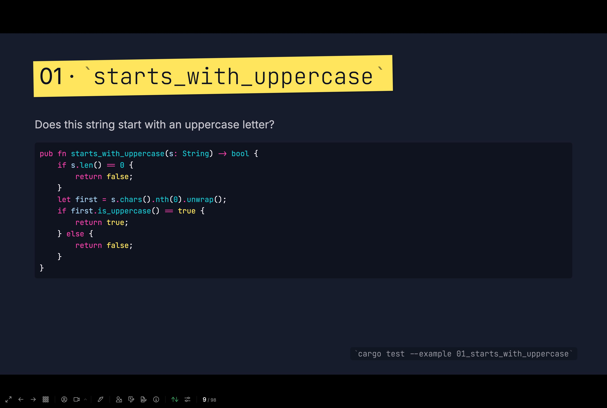

# Refactoring Rust



With Rustlings and 100 exercises to learn Rust, there exist two excellent
resources for learning Rust.

What I found to be lacking was a more advanced course, which teaches Rust
idioms and patterns by means of refactoring exercises, for typical real-world
scenarios.

That's what "Refactoring Rust" is all about.

Each exercise asks you to take a small, working-but-awkward piece of code
and make it more idiomatic. There is typically more than one good answer.
The goal is not to be a definitive source of truth, but rather to give us
something concrete to talk about.

## Running an exercise

```sh
cargo run --example 01_starts_with_uppercase
cargo test --example 01_starts_with_uppercase
```

## Overview

The examples are numbered roughly by complexity. We'll start with quick
warm-ups everyone can finish in a few minutes and gradually move into
larger structural refactors. Feel free to skip around: each example is
self-contained.

