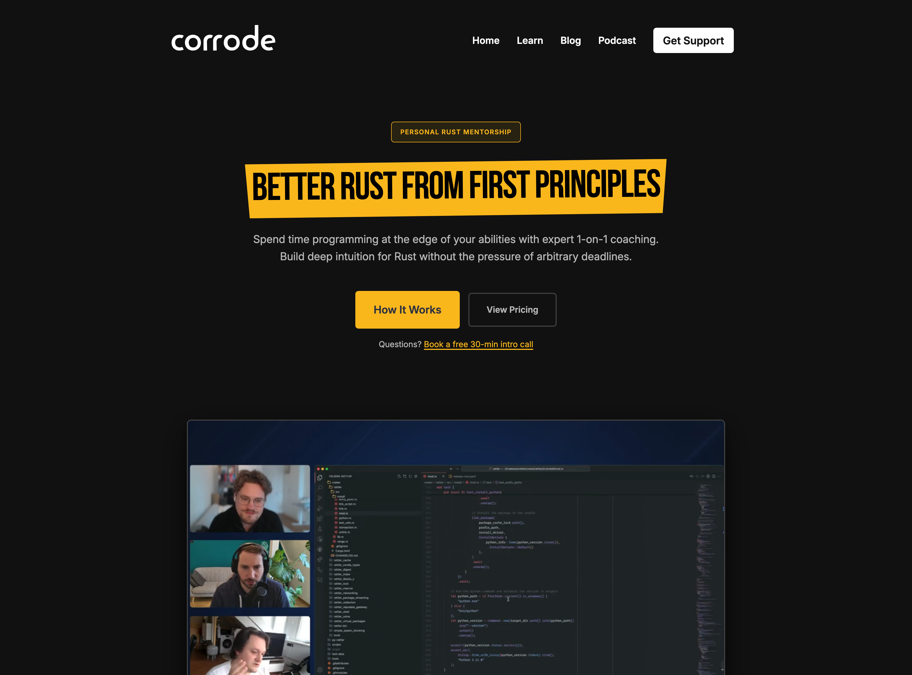
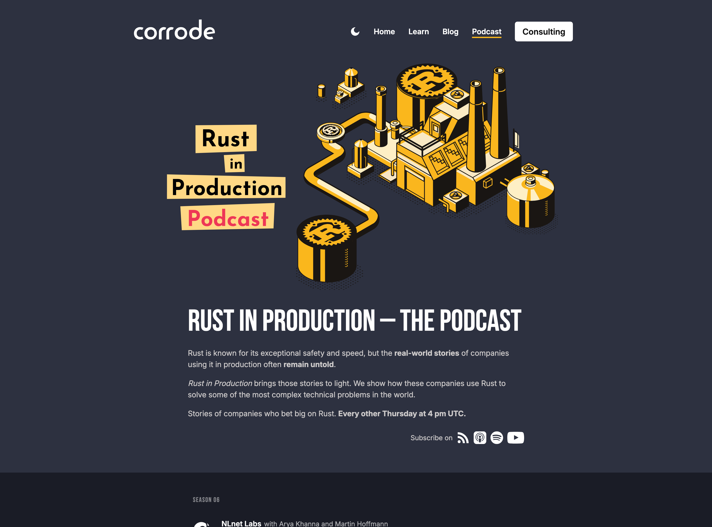

<AccentStripe />

# Writing Better Rust

## Fully Using the Type System

A refactoring workshop

Matthias Endler · Corrode

---
layout: about-me
helloMsg: Hello!
name: Matthias Endler
imageSrc: /me.png
position: left
job: Rust Consultant
line1: Host of Rust in Production
social1: "@mre"
social2: corrode.dev
---

---

# About you

Let's get acquainted. 

### 👋 Who
- Name and where you're from
- What do you do day to day?
- What are your main programming languages?

### 🦀 Rust
- How long have you been writing Rust?
- What do you use it for? (work, side project, learning)

### 🔥 Wildcard
- What do you want to take away from this workshop?
- Favourite crate of the moment

---
src: ./pages/00_motivation.md
---

---
src: ./pages/00_schedule.md
---

---
src: ./pages/00_how_it_works.md
---

---
src: ./pages/00_arc_overview.md
---

---
layout: section
---

<AccentStripe />

Phase 1 of 6

# Warm-ups

Types, signatures, simple matches.

The point is to get talking. Most of the "fix" is a one-line signature change
or a Clippy lint you've seen a hundred times.

Exercises 01–04

---
src: ./pages/01_starts_with_uppercase.md
---

---
src: ./pages/02_better_match.md
---

---
src: ./pages/03_path.md
---

---
src: ./pages/04_truncate_string.md
---

---
layout: section
---

<AccentStripe />

Phase 2 of 6

# `Option` · `Result` · iterators

The idioms that show up in almost every Rust file.

Exercises 05–09

---
src: ./pages/05_let_else.md
---

---
src: ./pages/06_nesting.md
---

---
src: ./pages/07_optional_values.md
---

---
src: ./pages/08_parse_ints.md
---

---
src: ./pages/09_distinct_characters.md
---

---
layout: section
---

<AccentStripe />

Phase 3 of 6

# Aggregations & counting

For-loops with accumulators become iterator chains.

Exercises 10–13

---
src: ./pages/10_room_occupancy.md
---

---
src: ./pages/11_highest_and_lowest.md
---

---
src: ./pages/12_mode.md
---

---
src: ./pages/13_iterators.md
---

---
layout: section
---

<AccentStripe />

Phase 4 of 6

# Parsing & error handling

Where <code>?</code>, <code>FromStr</code>, and custom error types earn their keep.

Exercises 14–18

---
src: ./pages/14_error_handling.md
---

---
src: ./pages/15_parse_port.md
---

---
src: ./pages/16_trim_log_line.md
---

---
src: ./pages/17_parse_srt_timestamp.md
---

---
src: ./pages/18_iban_prefix_check.md
---

---
layout: section
---

<AccentStripe />

Phase 5 of 6

# Domain modeling

The fun part. We delete code by changing types.

Exercises 19–25

---
src: ./pages/19_excluded_path.md
---

---
src: ./pages/20_user_status.md
---

---
src: ./pages/21_spell_check.md
---

---
src: ./pages/22_transformer.md
---

---
src: ./pages/23_fun_strings_ext.md
---

---
src: ./pages/24_http_response_router.md
---

---
src: ./pages/25_config_loader.md
---

---
layout: section
---

<AccentStripe />

Phase 6 of 6

# Capstone

Lastly, two larger bonus problems.

Exercises 26–27

---
src: ./pages/26_env_file_parser.md
---

---
src: ./pages/27_mini_redis.md
---

---
layout: center
---

# Want more of this?

## [corrode.dev/pro](https://corrode.dev/pro)

Personalized Rust code reviews and 1:1 mentorship from experienced Rust engineers.

Bring your own code. Get focused feedback, idiomatic refactors, and answers to the questions your team can't.

---
layout: center
---

# Podcast 

## [corrode.dev/podcast](https://corrode.dev/podcast)

A podcast about how Rust is used in the real world. We talk to engineers from all kinds of companies about their Rust codebases, the problems they solve with Rust, and the lessons they've learned along the way.

---
layout: center
---

# That's a wrap!

Thank you.

Questions or your own code you want to discuss?

corrode.dev · @matthiasendler

